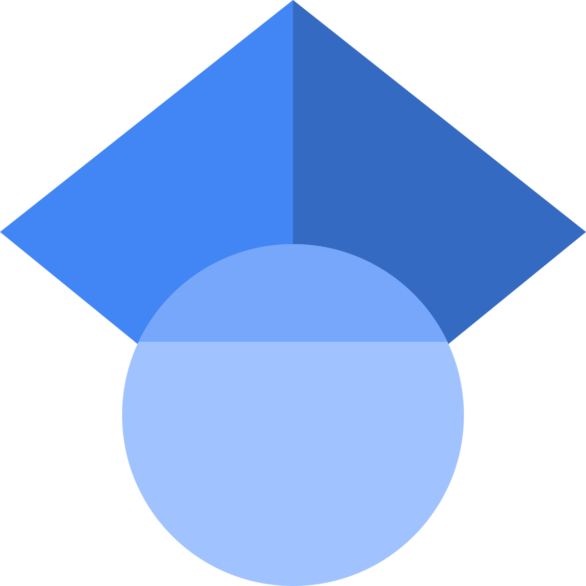

<html>
<body>

<!--

<a href="mailto:erfan.asadipour@fsec.ucf.edu" style="text-decoration: none">
  &#x2709; erfan.asadipour@ucf.edu
</a>

<h4 style= "margin-left: 10px"> Background </h4>

 I am a chemical engineer.  
 -->

  <a href="/"> 
 About 
 </a> &#x2022; 
  <a href="/Publications"> 
 Publications, Presentations, and Services 
 </a> &#x2022;  

<h2> Background and Research Interests </h2>

 Welcome to my homepage. I am a passionate electrochemical and device engineering researcher with experience in developing polymeric materials, as well as reactor and process modeling and experimentation for electrochemical flow reactors, such as redox flow batteries and electrolyzers.  I am particularly interested in developing polymeric materials, physics-based and physics-informed neural network models, and experimental setups for optimizing reactor and process performances of chemical and electrochemical systems that enable a sustainable and clean energy future. 

<h2> Education </h2>

<ul style="line-height:200%; margin-left: 10px; margin-right:10px">
<li>  <b> Ph.D. </b>, Energy, Environmental and Chemical Engineering, Washington University in St. Louis, USA, <b> 2025 </b>   Dissertation title: <em> Enhancing Ion Transport and Electron Transfer in Redox Flow Batteries through Component Design </em>   <a href="https://sites.wustl.edu/ramanilab/"> Electrochemical Engineering Research Laboratory </a>    PI: Prof. Vijay Ramani  </li> 
<li>  <b> M.Sc. </b>, Energy, Environmental and Chemical Engineering, Washington University in St. Louis, USA, <b> 2021 </b>   Thesis title: <em> Analysis of Fluid Flow in Redox Flow Batteries </em>   Electrochemical Engineering Research Laboratory   PI: Prof. Vijay Ramani  </li>
<li>  <b> B.Sc. </b>, Mechanical Engineering, Sharif University of Technology, Iran, <b> 2018 </b>   PI: Prof. Vahid Hosseini </li>
</ul>

</body>
</html>
